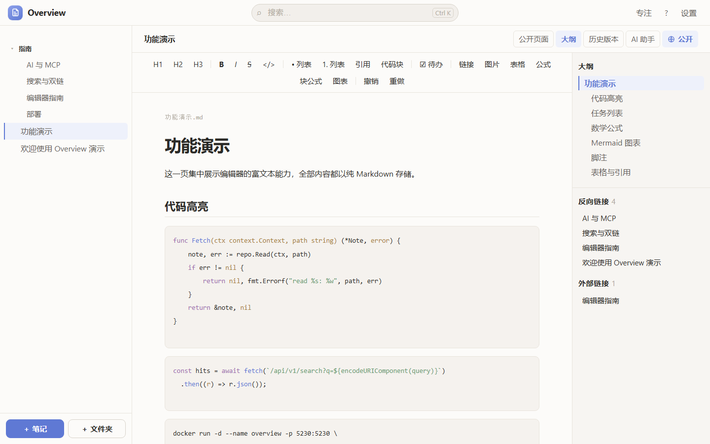

# Overview

> A self-hosted, folder-based Markdown knowledge base — **files as the source of truth**, AI-native, and deployable as a single binary.

[](https://github.com/Overview-Note/overview/actions/workflows/ci.yml)
[](https://go.dev)
[](https://vuejs.org)
[](LICENSE)
[](Dockerfile)

Overview is what you get when you take the simplicity of [memos](https://github.com/usememos/memos),
add the **hierarchy memos lacks**, and keep your content as **plain Markdown files** you
fully own. It ships as one Go binary with the frontend embedded, indexes content with
SQLite FTS5, and exposes the vault over REST, **WebDAV**, and the **Model Context Protocol (MCP)**.



---

## Why Overview?

| | memos | Obsidian | Overview |
|---|:---:|:---:|:---:|
| Self-hosted web app | ✅ | ❌ | ✅ |
| Folder hierarchy / nested tree | ❌ | ✅ | ✅ |
| Plain-Markdown files on disk | ❌ (DB) | ✅ | ✅ |
| Built-in full-text search (CJK-aware) | ⚠️ | ✅ | ✅ |
| REST API + WebDAV | partial | ❌ | ✅ |
| MCP server for AI agents | ❌ | ❌ | ✅ |
| Built-in AI assistant | ❌ | plugin | ✅ |
| Single binary / one `docker run` | ✅ | ❌ | ✅ |

**Design goals**

1. **Files are the truth.** Every note is a Markdown file with YAML frontmatter; the
   SQLite index is disposable and fully rebuildable. Point any editor, Git, or another
   tool at the same `data/` directory.
2. **Hierarchy without lock-in.** Folders on disk are the document tree.
3. **Boring to operate.** One process, no external services required (SQLite + files).
4. **Open by design.** Everything is reachable through well-defined ports: REST, WebDAV, MCP.

---

## Feature Highlights

### 📚 Content & organization
- **Hierarchical folders** — physical directories map directly to the navigation tree
- **Markdown as the source of truth** — Git-friendly, portable, no vendor lock-in
- **Wiki-links & backlinks** — `[[Note]]` / `[[Note|alias]]`, with a backlinks panel;
  targets resolve by full path, title, or file name
- **Per-note visibility** — Private or Public (share a read-only **globe page** at `/public/<path>`)

### ✍️ Editing
- **Rich editor** — Vue 3 + Tiptap: headings, lists, quotes, code, images, tables
- **Code highlighting**, **task lists**, **math (KaTeX)** and **Mermaid diagrams**, plus
  **GFM footnotes** — all stored as plain Markdown
- **Images** — paste / drag-and-drop, with optional **client-side compression** (WebP/JPEG)
- **Slash commands** — type `/` for headings, lists, tasks, tables, math, diagrams, code blocks
- **Outline (TOC)** — scroll-linked table of contents
- **Table bubble menu** — row/column controls appear right above the active table
- **Focus mode** (`F9`) and a **keyboard-shortcuts** panel (`?`)

### 🔎 Search & navigation
- **Full-text search** with SQLite FTS5 and a custom **CJK unigram + bigram tokenizer**
  for real substring matching (e.g. `发模` matches `并发模型`)
- **Global search** with `Ctrl`/`Cmd` + `K`

### 🤖 AI-native
- **AI assistant** — chat, *organize* and *complete* notes, using any OpenAI-compatible
  endpoint (OpenAI, DeepSeek, Ollama, vLLM, …)
- **MCP server** — expose notes as tools so AI agents can list/search/read/write
  (`notes_list`, `notes_search`, `notes_read`, `notes_write`, `notes_delete`, `notes_links`)

### 🔐 Access & integration
- **Multi-user auth** — bcrypt, sessions, admin/member roles, first-run setup wizard
- **WebDAV** — mount the vault in Obsidian, Finder, or mobile apps
- **REST API** — versioned under `/api/v1`, documented via OpenAPI at `/api/docs`
- **PWA** — installable app shell
- **Quick capture** — a bookmarklet that saves a page's title/URL/selection as a note

### 🛠 Operations
- **Single binary** with the frontend embedded (`docker run` or `go run`)
- **Structured logging** — JSON or text, to stdout and/or a rotating log file
- **SQLite migrations**, atomic writes, optimistic concurrency (ETag / 409)
- **Version history** (revision snapshots) and **trash** (soft delete + restore)
- **Live sync** — a file watcher reindexes external edits
- **Portable archive** — export/import the whole vault (notes + assets) as a ZIP
- **CLI** — every vault operation (list, read, write, search, move, history, trash, …)
  runs directly against `data/` with no server, for scripts and tools
- **Pluggable storage** — local filesystem or any S3-compatible object store
- **Settings center** — theme (system/light/dark), font size, language, compression, AI config
- **Static export & sitemap/robots** — publish public notes as a read-only site

---

## Quick Start

### Try the demo (no setup)

```bash
git clone https://github.com/Overview-Note/overview.git
cd overview
make demo            # serves ./demo on http://localhost:5230, auth disabled
```

The `demo/` vault showcases code highlighting, task lists, KaTeX math, Mermaid
diagrams, footnotes and wiki-links. See [`demo/README.md`](demo/README.md).

### Docker (recommended)

```bash
git clone https://github.com/Overview-Note/overview.git
cd overview
docker compose up -d --build
# open http://localhost:5230 and complete the first-run admin setup
```

### Prebuilt binary

Download the binary for your OS/arch from
[Releases](https://github.com/Overview-Note/overview/releases), or install with Go:

```bash
go install github.com/Overview-Note/overview/cmd/overview@latest
OVERVIEW_DATA_DIR=./data overview
```

Open http://localhost:5230 and complete the first-run admin setup.

### Local development

```bash
# backend (serves the embedded frontend) on :5230
go run ./cmd/overview

# frontend with hot reload on :5173 (proxies /api to :5230)
cd web && npm install && npm run dev
```

Build a single binary with the frontend embedded:

```bash
make build        # == cd web && npm run build && go build -o bin/overview ./cmd/overview
```

---

## Configuration

Overview is configured entirely through environment variables.

| Variable | Default | Description |
| --- | --- | --- |
| `OVERVIEW_ADDR` | `:5230` | Listen address |
| `OVERVIEW_DATA_DIR` | `./data` | Data root (`notes/`, `assets/`, DB, …) |
| `OVERVIEW_DB` | `<data>/overview.db` | SQLite index path |
| `OVERVIEW_MAX_UPLOAD_MB` | `32` | Upload size limit |
| `OVERVIEW_HISTORY_KEEP` | `50` | Revisions kept per note (`0` disables pruning) |
| `OVERVIEW_LOG_LEVEL` | `info` | `debug` / `info` / `warn` / `error` |
| `OVERVIEW_LOG_FORMAT` | `json` | `json` or `text` |
| `OVERVIEW_LOG_FILE` | — | Log file path (stdout only when unset); rotates on size |
| `OVERVIEW_LOG_MAX_MB` | `10` | Max log file size before rotation |
| `OVERVIEW_LOG_BACKUPS` | `3` | Rotated files to keep (`0` truncates) |
| `OVERVIEW_AUTH` | `multi` | `multi` (users + login) or `none` |
| `OVERVIEW_SITE_TITLE` | `Overview` | Site title (UI and render mode) |
| `OVERVIEW_RENDER` | `false` | `true` → public read-only docs site |
| `OVERVIEW_MCP_TOKEN` | — | Bearer token for MCP; falls back to session tokens |
| `OVERVIEW_AI_BASE_URL` | — | OpenAI-compatible base URL (enables AI when set) |
| `OVERVIEW_AI_API_KEY` | — | AI provider API key |
| `OVERVIEW_AI_MODEL` | `gpt-4o-mini` | AI model name |
| `OVERVIEW_S3_BUCKET` | — | Enables S3-compatible asset storage when set |
| `OVERVIEW_S3_ENDPOINT` | — | S3 endpoint (e.g. `s3.amazonaws.com`) |
| `OVERVIEW_S3_REGION` | `us-east-1` | S3 region |
| `OVERVIEW_S3_ACCESS_KEY` / `OVERVIEW_S3_SECRET_KEY` | — | S3 credentials |
| `OVERVIEW_S3_USE_SSL` | `true` | Use HTTPS for S3 |
| `OVERVIEW_S3_PUBLIC_URL` | — | Optional CDN / public URL prefix |

> AI can also be configured at runtime in **Settings → AI** (admin only) — no restart needed.

`overview export` (static site) additionally reads `OVERVIEW_EXPORT_DIR` (default `_site`)
and `OVERVIEW_EXPORT_BASE` (URL prefix, default `/`).

---

## Integrations

**WebDAV**

```
http://<host>:5230/dav/
```
Sign in with your Overview username and password (HTTP Basic). Edits saved over WebDAV
are re-indexed automatically.

**MCP (Model Context Protocol)**

Point an MCP client at `http://<host>:5230/mcp` with `Authorization: Bearer <OVERVIEW_MCP_TOKEN>`.
Implements the current spec (`2026-07-28`: stateless `_meta`, `server/discover`,
`resultType`) while remaining compatible with older `initialize`-handshake clients.
The tool surface mirrors the CLI/REST API: notes (list/search/read/write/delete/move/
rename/links/resolve), folders, history (list/read/restore), trash (list/restore/purge),
assets (upload/orphans/purge), reindex and public notes.

**OpenAPI**

- Interactive docs: `/api/docs`
- Machine-readable spec: `/api/v1/openapi.json`

---

## Command-line interface

The same operations exposed by the REST API are available as commands that run
**directly against the data directory** (no server). Handy for scripting, editors,
and AI tools — Overview becomes a plain Markdown editor/index over a folder.

```bash
overview list                                   # note tree
overview search "并发模型" --limit 10
overview read "Guide/Intro.md"                  # print the Markdown body
overview write "Guide/Intro.md" --file draft.md --public
printf '# Deploy\n\nnotes\n' | overview write "Ops/Deploy.md" --stdin
overview move "Guide/Intro.md" "Archived/Intro.md"
overview history "Guide/Intro.md"               # revisions
overview restore "Guide/Intro.md" <id>
overview export-zip vault.zip && overview import vault.zip
overview build ./public --all                   # deployable static site
```

Global flags: `-C, --data-dir DIR` (target a vault) and `--json` (machine-readable
output). Run `overview help` for the full list. See [[CLI]] in the docs site.

---

## Documentation site

This project's own documentation is **built with Overview** (dogfooding). The notes live
under [`site/notes`](site) and are rendered two ways:

- **Live server** — read-only *render mode* (no login, only public notes):
  ```bash
  make site            # http://localhost:5230
  ```
- **Static export** — for GitHub Pages and any static host:
  ```bash
  make site-export     # outputs ./_site
  ```

The export is deployed automatically to GitHub Pages by
[`.github/workflows/pages.yml`](.github/workflows/pages.yml).

## Data Layout

```
data/
├── notes/        # Markdown files — the source of truth (folders = hierarchy)
├── assets/       # uploaded attachments (or S3 when configured)
├── .history/     # note revision snapshots
├── .trash/       # soft-deleted notes
└── overview.db   # SQLite index (safe to delete; rebuilt on startup)
```

---

## Architecture

```
┌──────────────────────────────────────────────────────────┐
│  Browser (Vue 3 SPA)   │  Mobile / third-party (REST)     │
└──────────────┬───────────────────────────────────────────┘
               │ HTTP
┌──────────────▼───────────────────────────────────────────┐
│  server   HTTP adapter · /api/v1 · middleware · ETag      │
├───────────────────────────────────────────────────────────┤
│  service  use cases · transaction boundaries · tree build │
├───────────────────────────────────────────────────────────┤
│  core     domain models · ports (interfaces) · errors     │
├────────────┬───────────────┬──────────────────────────────┤
│  store     │  index        │  textproc                    │
│ filesystem │ SQLite + FTS5 │ CJK tokenizer / snippets     │
└────────────┴───────────────┴──────────────────────────────┘
```

- **Layered & dependency-inverted:** `service` depends only on interfaces in `core`,
  so backends can be swapped (e.g. S3 assets) without touching business logic.
- **Adapters stay thin:** the same `service` powers REST, WebDAV, and MCP.
- **Full details:** see [`docs/DESIGN.md`](docs/DESIGN.md) (architecture decision records included).

---

## Development

```bash
make demo       # run the sample vault in demo/ on :5230 (first visit creates an admin)
make dev        # run the backend with the embedded frontend
make test       # run all tests (Go + frontend Vitest)
make test-web   # frontend type-check + unit tests
make lint       # golangci-lint + vue-tsc
make fmt        # gofmt + prettier
make build      # build the single binary (frontend embedded)
make docker     # build the Docker image
```

Requirements: **Go 1.26+**, **Node 22+**, and **Docker** (optional).

---

## Roadmap

**Shipped**

- [x] Folder hierarchy, Markdown storage, FTS5 search
- [x] Rich editor (images, tables, slash commands, TOC)
- [x] Wiki-links & backlinks
- [x] Multi-user auth, WebDAV, public sharing
- [x] MCP server, AI assistant (chat / organize / complete)
- [x] Version history, trash, incremental indexing + file watcher
- [x] S3 assets, PWA, OpenAPI docs, settings center
- [x] Code highlighting, task lists, math (KaTeX), Mermaid diagrams, footnotes
- [x] Drag-and-drop tree, ZIP import/export, browser quick capture, focus mode
- [x] Sitemap/robots, public pages styled as a docs site
- [x] Render-mode API whitelist, history retention, static-site search, incremental WebDAV,
  full OpenAPI spec, lossless table/wiki-link round-trip
- [x] Offline CLI (notes/search/history/trash/assets/archives) and `build` static-site command
- [x] MCP upgraded to `2026-07-28` (stateless `_meta`, `server/discover`, `resultType`) with
  22 tools matching the CLI/REST surface
- [x] Performance: route code-splitting + gzip/immutable static caching (Lighthouse 99)
- [x] Note/document logo, soft warm theme, resizable stable sidebar, GHCR multi-arch images

**Not yet done** (see [`docs/DESIGN.md`](docs/DESIGN.md) §12 for the full backlog)

- [ ] Tags: management UI, tag tree, tag filtering, `#` autocomplete
- [ ] Pin / favorites, saved filter views, timeline view
- [ ] Real-time collaboration (SSE/WebSocket), comments, notifications
- [ ] Version diff view, draft persistence, non-image attachments in the UI
- [ ] Outbound webhooks, OIDC/SSO, gRPC, mobile-native app, more languages

See [`docs/DESIGN.md`](docs/DESIGN.md) for the full roadmap and known limitations.

---

## Contributing

Contributions of all kinds are welcome — bug reports, feature ideas, docs, and code.
Please read [`CONTRIBUTING.md`](CONTRIBUTING.md) and open an issue or pull request.
Good first issues are labeled `good first issue`.

## License

[MIT](LICENSE) © Overview contributors
