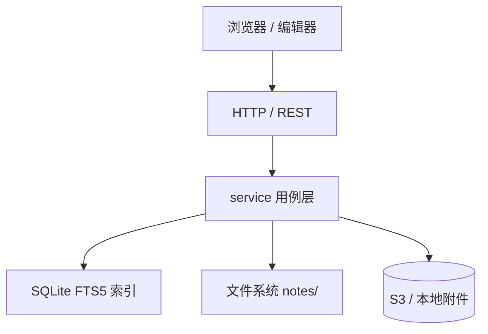
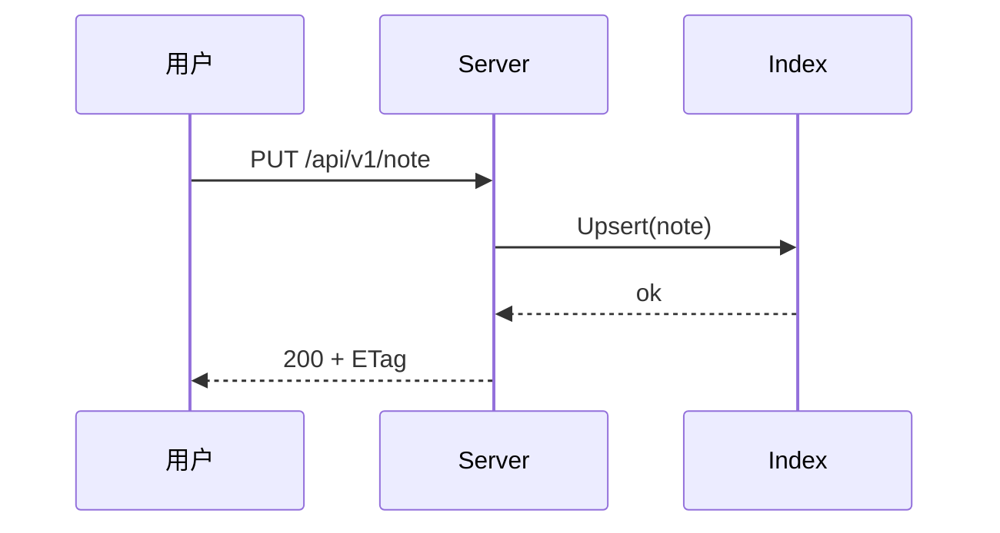

# 功能演示

这一页集中展示编辑器的富文本能力，全部内容都以纯 Markdown 存储。

## 代码高亮

```go
func Fetch(ctx context.Context, path string) (*Note, error) {
    note, err := repo.Read(ctx, path)
    if err != nil {
        return nil, fmt.Errorf("read %s: %w", path, err)
    }
    return &note, nil
}
```

```typescript
const hits = await fetch(`/api/v1/search?q=${encodeURIComponent(query)}`)
  .then((r) => r.json());
```

```bash
docker run -d --name overview -p 5230:5230 \
  -v ~/overview:/data Overview-Note/overview:latest
```

## 任务列表

- [x] 层级目录与 Markdown 存储
- [x] 全文搜索（中英文）
- [x] 代码高亮 / 任务列表 / 公式 / 图表
- [ ] 移动到文件夹（拖拽）
- [ ] 导入 / 导出 ZIP

## 数学公式

行内公式 $E = mc^2$，以及独立公式：

$$
\int_{-\infty}^{\infty} e^{-x^2}\,dx = \sqrt{\pi}
$$

矩阵同样支持：

$$
A = \begin{pmatrix} a & b \\ c & d \end{pmatrix}, \qquad
\det(A) = ad - bc
$$

## Mermaid 图表





## 脚注

Overview 支持 GFM 脚注[^1]，也支持较长的说明[^note]。

[^1]: 脚注会随 Markdown 一起保存，保持可移植。
[^note]: 脚注内容在编辑器中以节点形式保留，往返无损。

## 表格与引用

| 存储后端 | 配置 | 场景 |
| --- | --- | --- |
| 本地文件 | 默认 | 单机自托管 |
| S3 兼容 | `OVERVIEW_S3_BUCKET` | 对象存储 / CDN |

> 文件即真相：把 `data/` 交给 Git、Syncthing 或 WebDAV 皆可。

继续阅读 [[指南/编辑器]] 了解写作技巧。
