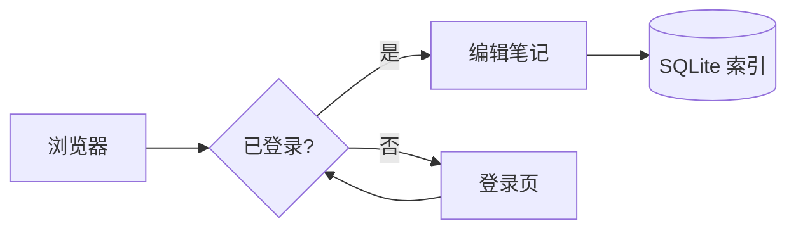
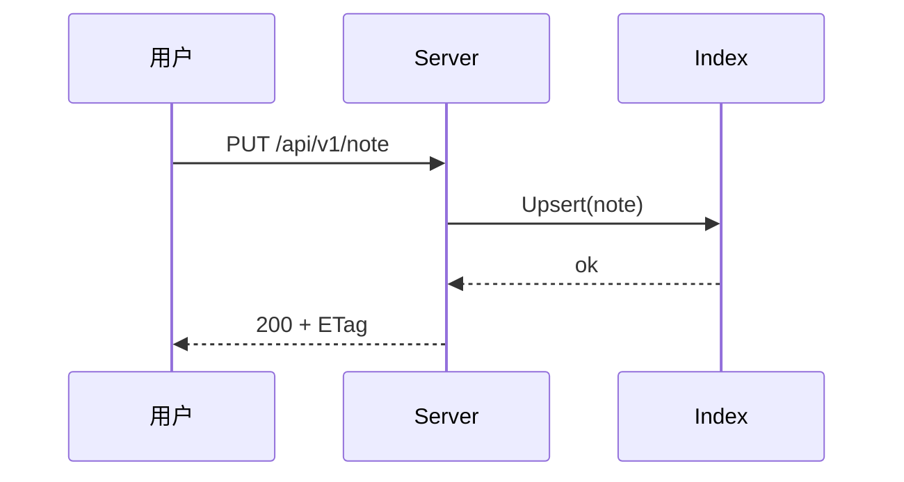
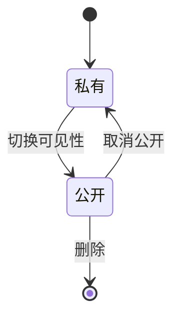
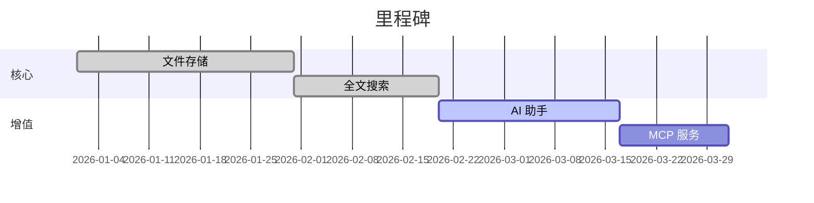

# Mermaid 图表

Mermaid 图表以 `mermaid` 围栏代码块书写，编辑器会实时渲染。

## 流程图（flowchart）

```mermaid
flowchart LR
  A[浏览器] --> B{已登录?}
  B -- 是 --> C[编辑笔记]
  B -- 否 --> D[登录页]
  D --> B
  C --> E[(SQLite 索引)]
```

## 时序图（sequenceDiagram）

```mermaid
sequenceDiagram
  participant U as 用户
  participant S as Server
  participant I as Index
  U->>S: PUT /api/v1/note
  S->>I: Upsert(note)
  I-->>S: ok
  S-->>U: 200 + ETag
```

## 状态图（stateDiagram）

```mermaid
stateDiagram-v2
  [*] --> 私有
  私有 --> 公开: 切换可见性
  公开 --> 私有: 取消公开
  公开 --> [*]: 删除
```

## 甘特图（gantt）

```mermaid
gantt
  title 里程碑
  dateFormat YYYY-MM-DD
  section 核心
  文件存储      :done,    a1, 2026-01-01, 30d
  全文搜索      :done,    a2, after a1, 20d
  section 增值
  AI 助手       :active,  b1, after a2, 25d
  MCP 服务      :         b2, after b1, 15d
```

下一步：[[提示块与引用]]。
